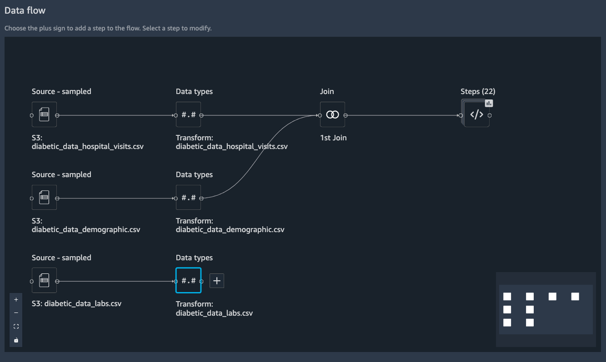

# Amazon SageMaker Data Wrangler Diabetic Patient Readmission Prediction Demo
In this demo, you will be running machine learning with SageMaker Data Wrangler and SageMaker features using a HCLS dataset. We will load the data into S3 behind the scene, create a DataWrangler flow file, load the data in from S3, wrangle the data with steps, then perform subsequent ML with automatically generated notebooks and python scripts. 

This instruction helps you set up the demo to run in front of customers. It highlights capabilities that are available and attractive to data scientists.

## Dataset
[UCI diabetic patient readmission dataset](https://archive.ics.uci.edu/ml/datasets/diabetes+130-us+hospitals+for+years+1999-2008). The dataset represents 10 years (1999-2008) of clinical care at 130 US hospitals and integrated delivery networks. It includes over 50 features representing patient and hospital outcomes.

## Target audience
ML specialists, ML SA, or field SA who would like to prepare a repeatable demo for customer in healthcare & life sciences vertical.

## Setting up
Please clone the package from [a repo].

You will start by downloading the dataset and uploading it to a S3 bucket for you to run the demo. Please visit and execute the code in [diabetes_datawrangler_demo_prep.ipynb](./diabetes_datawrangler_demo_prep.ipynb). The data will be available in `s3://sagemaker-${region}-${account_number}/sagemaker/demo-diabetic-datawrangler/` if you leave everything default.

## Data Wrangler flow overview
You can view the pre-built Data Wrangler flow file that comes along in the repo: [diabetes_readmission.flow](./diabetes_readmission.flow). 

It has multiple files from S3 loaded in: `diabetic_data_hospital_visits.csv`, `diabetic_data_demographic.csv` and `diabetic_data_labs.csv` for demonstration. It performs a inner join between the tables in `diabetic_data_hospital_visits.csv` and `diabetic_data_demographic.csv` by `encounter_id`. It applies 22 transformation steps to clean up the data to meet the following requirements: 
- no duplicate columns
- 